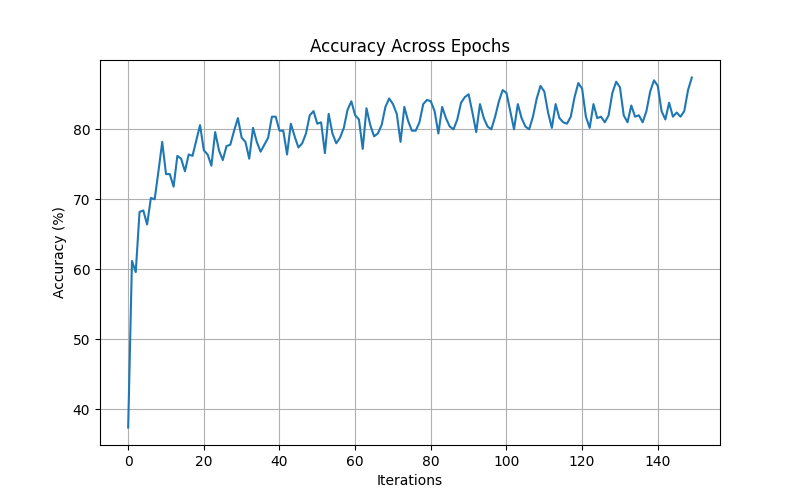
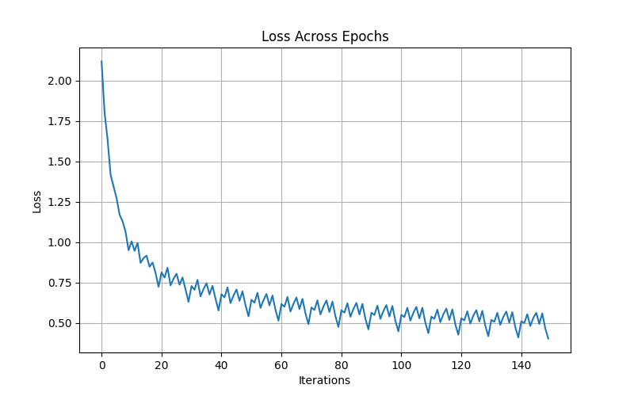

# Fashion MNIST CNN from Scratch using NumPy

## Project Overview

| Topic | Description |
| :--- | :--- |
| Project Title | Fashion MNIST CNN from Scratch |
| Domain | Deep Learning / Computer Vision |
| Objective | To implement a Convolutional Neural Network (CNN) completely from scratch using NumPy without using TensorFlow or PyTorch CNN layers |
| Dataset Used | Fashion MNIST |
| Problem Type | Multi-class Image Classification |
| Frameworks Used | NumPy, Matplotlib, TensorFlow/Keras (only for dataset loading) |
| Main Goal | To understand convolution, pooling, forward propagation, backward propagation, softmax classification, and optimization in CNNs |

---

# Introduction

| Description |
| :--- |
| Convolutional Neural Networks (CNNs) are one of the most important deep learning architectures used for image classification and computer vision tasks. CNNs automatically learn image features such as edges, textures, shapes, and patterns directly from raw pixel data using convolution operations. |
| In this project, the CNN architecture was implemented completely from scratch using NumPy in order to understand the internal working of CNNs at a deeper level. |
| Every major component including convolution layer, pooling layer, flattening, fully connected layer, softmax activation, forward propagation, backward propagation, and gradient descent optimization was manually implemented and integrated into a complete training pipeline. |

---

# Problem Statement

| Description |
| :--- |
| The objective of this project is to build a Convolutional Neural Network (CNN) from basic principles and train it on the Fashion MNIST dataset for image classification. |
| The project aims to demystify the internal functioning of CNNs by manually implementing every operation involved in training and prediction. |

---

# Dataset Information

| Property | Details |
| :--- | :--- |
| Dataset Name | Fashion MNIST |
| Total Images | 70,000 |
| Training Images | 60,000 |
| Testing Images | 10,000 |
| Training Images Used | 5,000 |
| Testing Images Used | 2,000 |
| Image Size | 28 × 28 |
| Image Type | Grayscale |
| Number of Classes | 10 |

---

# Fashion MNIST Classes

| Label | Class |
| :--- | :--- |
| 0 | T-shirt/top |
| 1 | Trouser |
| 2 | Pullover |
| 3 | Dress |
| 4 | Coat |
| 5 | Sandal |
| 6 | Shirt |
| 7 | Sneaker |
| 8 | Bag |
| 9 | Ankle boot |

---

# CNN Architecture

| Layer | Configuration | Output Shape |
| :--- | :--- | :--- |
| Input Layer | 28×28 grayscale image | 28×28 |
| Convolution Layer | 16 filters, 3×3 kernel | 26×26×16 |
| ReLU Activation | max(0,x) | 26×26×16 |
| Max Pooling Layer | 2×2 pooling | 13×13×16 |
| Flatten Layer | Converts feature maps into vector | 2704 |
| Fully Connected Layer | 2704 → 10 neurons | 10 |
| Softmax Layer | Probability distribution | 10 probabilities |

---

# Detailed Explanation of Layers

## Convolution Layer

| Feature | Explanation |
| :--- | :--- |
| Purpose | Extract spatial image features |
| Filters Used | 16 |
| Filter Size | 3×3 |
| Stride | 1 |
| Padding | None |
| Output | Feature maps containing important image patterns |

### Convolution Formula

```math
Y(i,j)=\sum_m\sum_n X(i+m,j+n)K(m,n)
```

---

## ReLU Activation Function

| Feature | Explanation |
| :--- | :--- |
| Purpose | Introduce non-linearity |
| Formula | ReLU(x)=max(0,x) |
| Benefit | Helps the CNN learn complex patterns |

---

## Max Pooling Layer

| Feature | Explanation |
| :--- | :--- |
| Pool Size | 2×2 |
| Stride | 2 |
| Purpose | Reduce dimensions and computation |
| Benefit | Retains important features while reducing memory usage |

---

## Flatten Layer

| Feature | Explanation |
| :--- | :--- |
| Purpose | Convert feature maps into 1D vector |
| Input Shape | 13×13×16 |
| Output Size | 2704 |

---

## Fully Connected Layer

| Feature | Explanation |
| :--- | :--- |
| Input Nodes | 2704 |
| Output Nodes | 10 |
| Purpose | Perform final classification |

---

## Softmax Activation

| Feature | Explanation |
| :--- | :--- |
| Purpose | Convert outputs into probabilities |
| Output | Probability distribution across 10 classes |

### Softmax Formula

```math
Softmax(x_i)=\frac{e^{x_i}}{\sum_j e^{x_j}}
```

---

# Loss Function

| Feature | Explanation |
| :--- | :--- |
| Loss Function Used | Cross Entropy Loss |
| Purpose | Measure prediction error |
| Goal | Minimize classification error |

### Formula

```math
L=-\log(p_y)
```

---

# Backpropagation

| Feature | Explanation |
| :--- | :--- |
| Purpose | Update weights to reduce loss |
| Optimization Method | Gradient Descent |
| Process | Gradients are computed and propagated backward through the network |

### Weight Update Formula

```math
W = W - \eta \frac{\partial L}{\partial W}
```

---

# Hyperparameters

| Hyperparameter | Value |

| Epochs | 15 |
| Learning Rate | 0.001 |
| Number of Filters | 16 |
| Filter Size | 3×3 |
| Training Samples | 5000 |
| Testing Samples | 2000 |
| Pool Size | 2×2 |
| Activation Functions | ReLU + Softmax |

---

# Training and Testing Performance

| Epoch | Average Training Accuracy | Average Training Loss |

| 1 | 68.0% | 0.896 |
| 2 | 73.2% | 0.742 |
| 3 | 76.4% | 0.681 |
| 4 | 78.1% | 0.642 |
| 5 | 80.0% | 0.553 |
| 6 | 81.3% | 0.528 |
| 7 | 82.0% | 0.516 |
| 8 | 82.8% | 0.507 |
| 9 | 83.5% | 0.498 |
| 10 | 84.0% | 0.603 |
| 11 | 85.1% | 0.471 |
| 12 | 86.0% | 0.446 |
| 13 | 86.8% | 0.418 |
| 14 | 87.0% | 0.410 |
| 15 | 87.4% | 0.403 |

---

# Final Evaluation Results

| Metric | Value |
| :--- | :--- |
| Final Training Accuracy | 87.4% |
| Final Test Accuracy | 81.9% |
| Final Test Loss | 0.547 |

---

# Observations

Observation :-

| 1 | Training accuracy steadily increased across epochs 
| 2 | Training loss consistently decreased indicating convergence 
| 3 | Test accuracy reached approximately 82% showing good generalization 
| 4 | CNN successfully learned important image features 
| 5 | Increasing filters and training samples improved performance 
| 6 | Gradient descent effectively minimized prediction error 

---

# Accuracy Graph



---

# Loss Graph




File / Folder :-  
graphs/accuracy.png -  Accuracy graph generated during training 
graphs/loss.png - Loss graph generated during training 
src/convolution.py - Convolution layer implementation 
src/pooling.py - Max Pooling layer implementation 
src/fully_connected.py - Fully connected layer and softmax 
src/loss.py - Cross entropy loss implementation 
src/train.py - Complete training pipeline 
README.md - Project documentation 
requirements.txt - Required Python dependencies 


| Step :- | Command :- |
| Create Virtual Environment | python -m venv venv |
| Activate Environment | venv\Scripts\activate |
| Install Dependencies | pip install -r requirements.txt |
| Run Training | python src/train.py |


| Concept :-  | Implementation:- |
| Convolution Operation | convolution.py |
| Feature Extraction | convolution.py |
| Forward Propagation | train.py |
| Backpropagation | fully_connected.py |
| Max Pooling | pooling.py |
| Softmax Classification | fully_connected.py |
| Cross Entropy Loss | loss.py |
| Gradient Descent | fully_connected.py |
| CNN Training Pipeline | train.py |


Limitationc:-
Pure NumPy implementation is slower than TensorFlow/PyTorch 
Only one convolution layer is used 
No dropout regularization 
No data augmentation 
Batch processing is not implemented 


Improvement :-
Add multiple convolution layers 
Implement dropout regularization 
Add batch normalization 
Use data augmentation 
Implement mini-batch gradient descent 
Train on the complete dataset 


Conclusion :-
This project successfully demonstrates the implementation of a Convolutional Neural Network (CNN) completely from scratch using NumPy. The CNN was able to extract image features, reduce dimensionality using pooling, classify Fashion MNIST images effectively, and achieve strong training and testing accuracy. The project provided a deep understanding of convolution operations, feature extraction, forward propagation, backpropagation, and optimization techniques. 